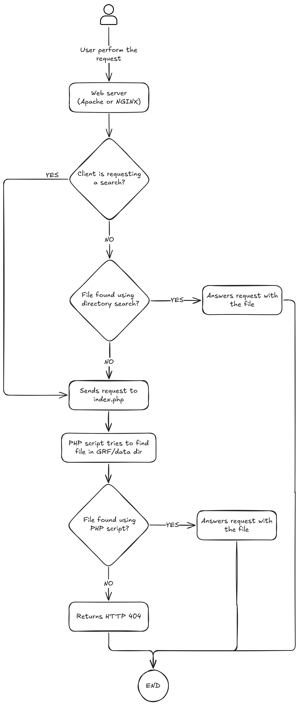

Setup the remote client
=======================

The remote client exist to help users without a FullClient on their computer to play by downloading resources from an external server.
Because pushing directly the fullclient on a server/ftp can provoke some errors, this tool allow to :

 - Get the files from a client used in another domain (Cross-origin resource sharing).
 - Extracting files directly from GRF archive (versions 0x200 and 0x300 supported - without DES encryption).
 - Converting BMP files to PNG to speed up the transfer.
 - Optimized to don't call any script if files are already extracted/converted (resource friendly).
 - **File Index for O(1) lookups**: Files are indexed at startup for instant lookups instead of sequential search through GRFs.
 - **Gzip/Deflate Compression**: Automatically compresses text-based responses (XML, TXT, LUA, etc.) to reduce bandwidth.
 - **HTTP Cache Headers** (ETag, Cache-Control, 304 Not Modified) for browser caching.
 - **LRU Cache** for fast repeated file access (in-memory caching).
 - **Health Check API** (`/api/health`) for monitoring and diagnostics.

###Add your fullclient###

Just put your GRFs files and DATA.INI file in the `resources/` directory.
Overwrite the `BGM/`, `data/` and `System/` directories with your own folders.

**Note: to be sure to use a compatible version of your GRFs, download *GRF Builder* and repack them manually (Option > Repack type > Decrypt -> Repack), it will ensure the GRFs files are converted in the proper version**

## Performance Features

### HTTP Cache Headers

The server implements proper HTTP cache headers for browser caching:

- **ETag**: Content-based validation for conditional requests
- **304 Not Modified**: Reduces bandwidth by validating client cache
- **Cache-Control**: Optimized per file type
  - Game assets (sprites, maps, etc.): 1 year with `immutable`
  - Other files: 30 days
- **Expires**: HTTP/1.0 compatibility

This significantly reduces bandwidth and speeds up repeated requests, as unchanged files are served from browser cache.
### LRU File Cache

The server implements an in-memory LRU (Least Recently Used) cache for file content:

- **Default**: 100 files, 256MB max memory
- **O(1)** get/set operations
- Automatic eviction of least recently used files
- Configurable via environment variables

```env
CACHE_ENABLED=true
CACHE_MAX_FILES=100
CACHE_MAX_MEMORY_MB=256
```

| Setting | Description | Default |
|---------|-------------|---------|
| `CACHE_ENABLED` | Enable/disable cache | `true` |
| `CACHE_MAX_FILES` | Max files in cache | `100` |
| `CACHE_MAX_MEMORY_MB` | Max memory usage | `256` MB |
### GRF Version Support

| Version | Status | Notes |
|---------|--------|-------|
| 0x200 | ✅ Supported | 32-bit file offsets, no DES encryption |
| 0x300 | ✅ Supported | 64-bit file offsets (files > 4GB), no DES encryption |
| DES Encrypted | ❌ Not Supported | Repack with GRF Builder to remove encryption |

## API Endpoints

The remote client provides several API endpoints for monitoring and diagnostics:

### Health Check

| Endpoint | Description |
|----------|-------------|
| `GET /api/health` | Complete system health status |
| `GET /api/health/simple` | Simple status check (fast) |
| `GET /api/cache-stats` | Cache and index statistics |

**Example response for `/api/health`:**

```json
{
    "status": "ok",
    "timestamp": "2026-01-18T12:00:00+00:00",
    "grfs": {
        "total": 2,
        "valid": 2
    },
    "cache": {
        "enabled": true,
        "items": 45,
        "hitRate": "96.5%"
    },
    "index": {
        "totalFiles": 450000
    },
    "hasWarnings": false
}
```

## Running the Remote Client

### Using Docker container

You can use this setup with the container to run the remote client API. Using docker container does not handle/copy 
the game files. You need to set up them first on the directory.

Copy the file [.env.example](.env.example) to the same directory as .env

After copying the game files and modifiying your .env file, you can start the container services.

#### I want to use NGINX server

You can start using the remote client with NGINX using the following command:

```bash
docker compose --profile nginx up --build
```

The webserver will be answering requests on the 80 port.

#### I want to use Apache server

```bash
docker compose --profile apache up --build
```

## FAQ

### How I can change NGINX/Apache virtual host configuration?

The vhosts configuration for both Apache and NGINX are baked into the container recipe. If you need to change this, 
you have to modify the respective [Apache Dockerfile](docker/apache/Dockerfile) or [NGINX dockerfile](docker/nginx/Dockerfile)
and re-run the docker compose command.

You can also override vhost configuration on **/etc/apache2/sites-available/000-default.conf** for Apache or **/etc/nginx/conf.d/default.conf** for NGINX
using docker compose specification adding a bind mount, example:

```yaml
volumes:
  - ./:/var/www/html:ro
  - ./my-own-nginx.conf:/etc/nginx/conf.d/default.conf
```

### How can I make sure that my remote client works as expected?

If you set up all the required files correctly, you can run the python script [tester.py](docker/test/tester.py). This
script reads a file list in the same directory (list.txt) that contains multiple filenames that should be in a GRF.
The script will request each file to the target webserver defined in **TARGET_SERVER_ADDRESS** variable, checking if the 
server answers with an HTTP code 200, if not, a new log file is created with the HTTP code and the file url requested, so
you can debug it afterward.

Example, running the list against a working server (localhost, apache and nginx):

Apache
```
=== Final result ===
Total: 2784 | OK: 2784 | FAIL: 0
Elapsed time: 110.10 seconds
```
NGINX
```
=== Final result ===
Total: 2784 | OK: 2784 | FAIL: 0
Elapsed time: 1.86 seconds
```

### How this remote client works?

